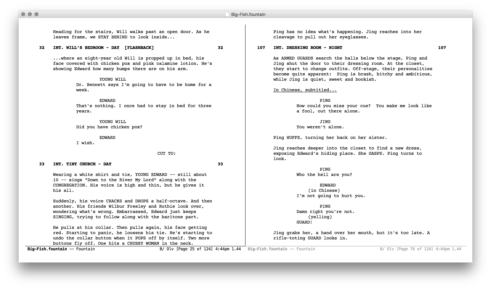

Fountain Mode
=============

[][1]
[][2]

Fountain Mode is a screenwriting program for GNU Emacs using the
Fountain plain text markup format.

For more information about the Fountain format, visit <https://fountain.io>

Features
--------

 - Support for the Fountain 1.1 specification
 - Export to PostScript or PDF using `troff`
 - WYSIWYG auto-align elements (display only, does not modify file
   contents) specific to script format, e.g. screenplay, stageplay or
   user-defined formats
 - Traditional TAB auto-completion writing style
 - Highly accurate pagination calculation
 - Navigation by section, scene, character name, or page
 - Integration with `outline` to fold/cycle visibility of sections,
   scenes and notes
 - Integration with `electric-pair-mode` to insert emphasis delimiters
   with single key (i.e. `*` or `_`)
 - Integration with `imenu` (sections, scene headings, notes)
 - Integration with `auto-insert` for title page metadata
 - Integration with `which-function-mode` to display live-update of current
   page and page count in mode-line
 - Automatically add/remove character `(CONT'D)`
 - Toggle syntax highlighting of each element
 - Toggle visibility of emphasis and syntax markup
 - Optionally display scene numbers in margins
 - Intelligent insertion of page breaks

Most common features are accessible from the menu. For a full list of
functions and key-bindings, type `C-h m`.

Requirements
------------

 - Emacs 24.4
 - seq 2.20 (part of Emacs 25 and later)

Exporting
---------

Fountain Mode can export to PostScript or PDF using the troff format as
an intermediary. This requires only a `troff` program on your system,
such as [GNU roff](https://www.gnu.org/software/groff/).

Alternatively you can export using an external command-line program,
such as:

 - [afterwriting](https://github.com/ifrost/afterwriting-labs/blob/master/docs/clients.md) (JavaScript)
 - [Wrap](https://github.com/Wraparound/wrap) (Go)
 - [screenplain](https://github.com/vilcans/screenplain) (Python 3)
 - [Textplay](https://github.com/olivertaylor/Textplay) (Ruby, requires PrinceXML for PDF)

The option `fountain-export-command-profiles` provides some shell
commands to interface with these tools, but you are encouraged to edit
or completely replace these to suit your own needs. The format is simple
while still allowing for flexibility.

Installation
------------

The latest stable release of Fountain Mode is available via
[MELPA-stable][1]. First, add MELPA-stable to your package archives:

    M-x customize-option RET package-archives RET
    
Insert an entry named `melpa-stable` with URL:
`https://stable.melpa.org/packages/`

You can then find the latest stable version of `fountain-mode` in the
list returned by:

    M-x list-packages RET

If you prefer the latest but perhaps unstable version, do the above
using [MELPA][2].

Advanced Installation
---------------------

Download the latest tagged release, move this file into your `load-path`
and add to your `init.el` file:

    (require 'fountain-mode)

If you wish to contribute to or alter Fountain Mode's code, clone the
repository into your load-path and require as above:

    git clone https://github.com/rnkn/fountain-mode.git

Bugs and Feature Requests
-------------------------

Use GitHub issues or send me an email (address in the package header).
For bugs, please ensure you can reproduce with:

    $ emacs -Q -l fountain-mode.el

[1]: https://stable.melpa.org/#/fountain-mode
[2]: https://melpa.org/#/fountain-mode
